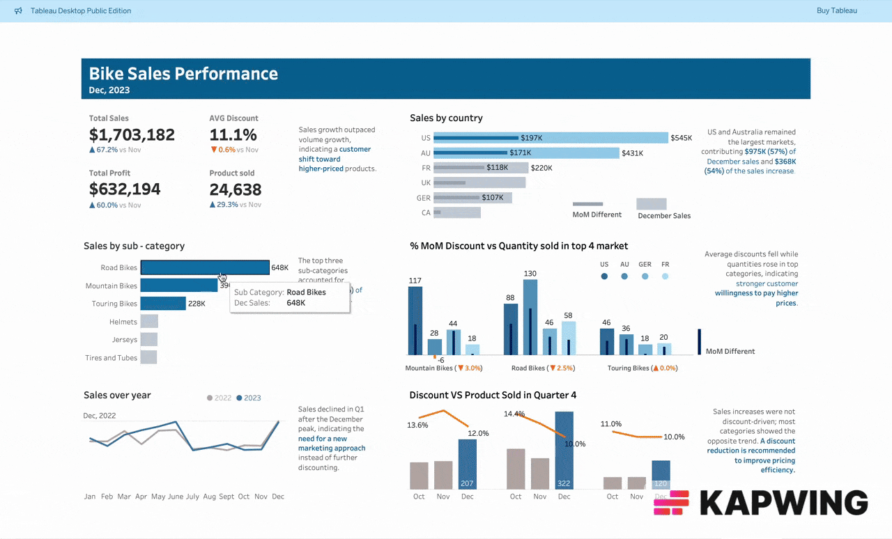

# Tableau Analytics: Bike Sales Performance &amp; Pricing Strategy Analysis (Dec 2023)

An interactive **Tableau report** analyzing **bike sales performance in December 2023**, focusing on sales growth, pricing trends, discount strategies, and regional market performance.

This project explores how sales growth was driven primarily by **higher-value product purchases rather than increased sales volume**, revealing a shift in customer purchasing behavior toward **higher-priced bikes and accessories**.

---

## 📊 Key Insights

- **Sales growth outpaced volume growth**, indicating that customers shifted toward **higher-priced products** rather than simply purchasing more units.

- The **top three sub-categories generated $1.26M in revenue**, accounting for **74.3% of total December sales**, showing strong product concentration.

- **United States and Australia remained the largest markets**, contributing:
  - **$975K (57%) of total December sales**
  - **$368K (54%) of total sales growth**

- **Average discounts decreased while quantities sold increased** in the top-performing categories, suggesting **stronger customer willingness to pay higher prices**.

- Sales increases were **not discount-driven**. In most categories, **discount rates fell while sales rose**, indicating healthy demand and improved pricing power.

---

## 💡 Business Recommendations

- **Reduce discount levels** to improve pricing efficiency and protect margins, since sales growth occurred despite lower discounts.

- **Focus marketing efforts on high-performing sub-categories** that already account for the majority of revenue.

- After the **December sales peak**, sales declined in **Q1**, likely due to **end-of-season effects**.

- Instead of increasing discounts to boost demand, a **new marketing strategy** is recommended to maintain post-season engagement and sales momentum.

---

## 🛠 Tools Used

- **Tableau**
- Data visualization
- Sales performance analysis
- Pricing and discount analysis

---

## 📈 Dashboard Features

- Sales performance overview
- Category and sub-category analysis
- Regional market comparison
- Discount vs sales trend analysis
- Interactive filters for deeper insights
